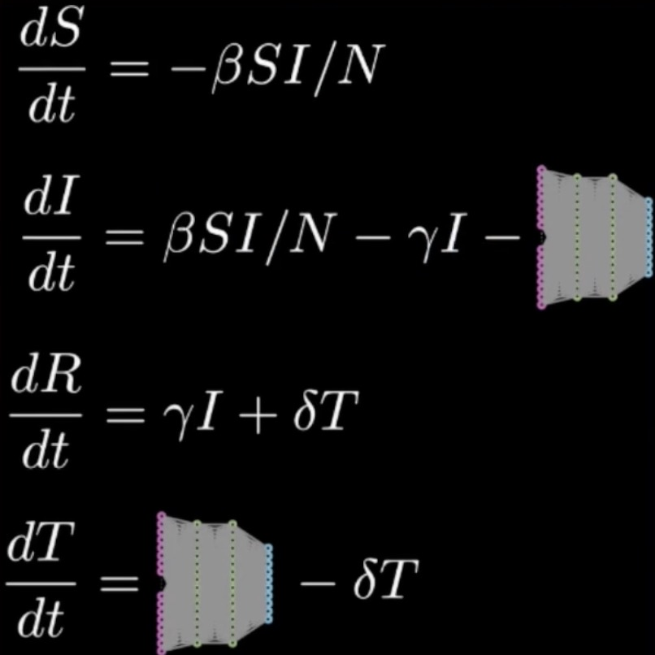

# Pandemic Modeling - Covid 19

The approach used here is the Scientific Machine Learning approach - an emerging field that combines the interpretability of mechanistic models with the predictive power of ML models.

In this project we'll see how Scientific ML can be used to predict the spread of infectious diseases such as COVID-19 by combining epidemiological models with the power of machine learning. 

Specifically, we'll focus on the SIR model, one of the simplest yet foundational models in epidemiology. It classifies population into three compartments: Susceptible (S), Infected (I), and Recovered (R). Initially, the population is largely susceptible, with only a small number of individuals infected. As the virus transmits through the population, susceptible individuals become infected. Over time, infected individuals recover and acquire immunity, reducing the number of those at risk.

This transition is represented by a system of three ordinary differential equations, each describing the rate of change for the Susceptible (S), Infected (I), and Recovered (R) populations. The model incorporates parameters such as τ_SI, which denotes the rate at which susceptible individuals become infected, and τ_IR, representing the rate at which infected individuals recover.

### Limitations of the SIR Model
While the SIR model provides a foundational framework for understanding disease spread, it has notable limitations. It oversimplifies real-world dynamics by excluding critical factors such as hospitalizations, deaths, quarantines, and behavioral variations. A significant challenge also lies in accurately estimating interaction parameters like τ_SI and τ_IR in real-world scenarios. It does not model social distancing and quarantine scenarios.

This is where machine learning becomes particularly useful. By leveraging large-scale datasets from multiple regions, machine learning models can learn these parameters more accurately, enabling reliable outbreak predictions.

## QSIR Model (Quarantine SIR Model)
To incoporate real-world scenarios such as quarantine, we need to subtract a term from the infected population. But we don't know the form that the term will look, so we replace that term with the neural network. And to compute gradients, we'll be using adjoint sensitivity method. 

$$
u' = [S, I, R, T]' = f(u, p, t) + NN(p)
$$

### Machine Learning to make predictions
We can utilize neural networks to learn a mapping from initial conditions—such as S(t=0), I(t=0), and R(t=0) to the number of infections observed at the end of a given time period, such as one month. However, traditional machine learning models often act as black boxes, offering little interpretability and ignoring established scientific structure.

### Problem with traditional Machine Learning
In the QSIR model, we already possess partial knowledge of the system. Disregarding this structure and relying solely on black-box models sacrifices valuable domain knowledge that could enhance accuracy and interpretability.

### Scientific Machine Learning
Scientific machine learning (SciML) bridges the gap between data-driven approaches and traditional scientific modeling by integrating known epidemiological relationships—such as those in the SIR model—into the learning process. This results in models that are both interpretable and accurate, even when some parameters are unknown.

One key technique in SciML is the use of Universal Differential Equations (UDEs). UDEs retain the underlying differential equations of traditional models while substituting unknown or difficult-to-estimate terms with neural networks. Unlike black-box models, UDEs preserve scientific structure and allow unknown components, like τ_SI and τ_IR, to be learned directly from data.

### Universal Differential Equations (UDE) for the QSIR Model
In the Universal Differential Equation (UDE) framework, traditional scientific models—such as the SIR model are enhanced by integrating neural networks to learn unknown dynamics from data, while preserving the known structure of the system.

Instead of assuming fixed values for the interaction parameters, UDEs use neural networks to estimate these values based on input features such as the current susceptible and infected populations. The outputs are then incorporated into the differential equations, which are solved using numerical integration methods (e.g Euler’s method or Runge-Kutta) to simulate system evolution over time.

#### **Neural Networks in the QSIR UDE**

Two neural networks—**NN1** and **NN2**—are introduced to model the unknown interaction parameters:

- **NN1 (for τ_SI)**  
  - **Inputs**: Susceptible population S(t) and infected population I(t) at time t
  - **Output**: Estimated infection rate τ_SI, used in the equations for $$\\frac{dS}{dt}\$$ and $$\\frac{dI}{dt}\$$

- **NN2 (for τ_IR)**  
  - **Input**: Infected population I(t) at time t
  - **Output**: Estimated recovery rate τ_IR, used in the equations for $$\\frac{dI}{dt}\$$ and $$\\frac{dR}{dt}\$$

These neural networks serve as functional approximators, learning to predict the interaction rates based on real-time inputs. To ensure meaningful results, inputs are typically normalized, and outputs are constrained to be positive, reflecting the non-negative nature of infection and recovery rates.

#### **Training the UDE**

The UDE is trained by comparing the predicted trajectories of S(t), I(t), and R(t) with observed real-world data using loss functions such as Mean Squared Error (MSE). Through backpropagation, the neural networks adjust their parameters to minimize this error.

#### **Advantages**

This hybrid approach blends the interpretability and structure of the classical SIR model with the flexibility of machine learning. It allows the model to capture complex, nonlinear, and time-varying behaviors of real-world epidemics, making it more robust for forecasting scenarios where full scientific knowledge is incomplete or where parameters vary across populations and time.

##### Documentation in-progress

### credits
SIR Model image - ResearchGate
